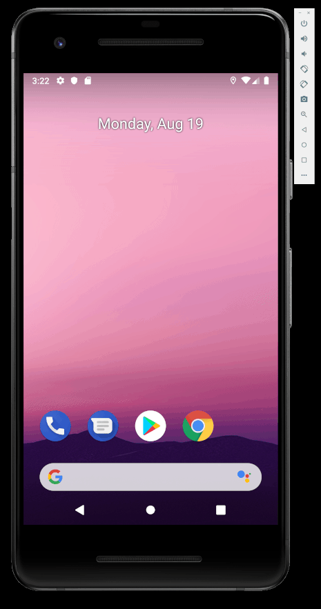

# DiceRoller

## Description

An Android application using the Kotlin language that simulates rolling dice.

## Demo

## Credits

Peter Akala

## License

See the [LICENSE](LICENSE.md) file for license rights and limitations (GNU GPLv3).
